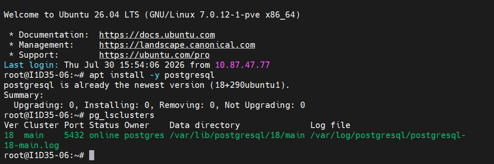
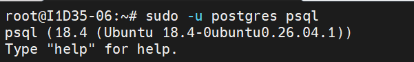
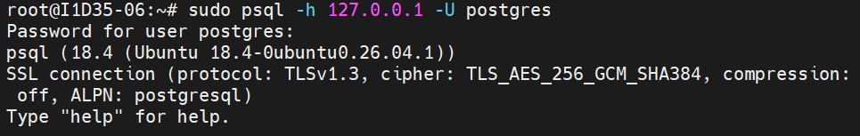
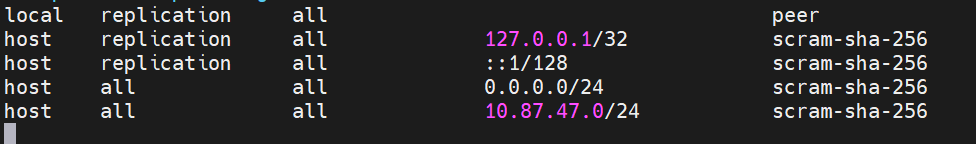

# Aula 02
Para verificar o status e demais informações do banco de dados, utilizamos o comando:

```bash
pg_lsclusters
```



---

Para acesso, via root, sem senha (SOCKET LOCAL), usamos o comando:

```bash
sudo -u postgres psql
```


>Com esse comando, não preciso mostrar quem o meu usuário é, o Linux já faz a autenticação.

>`\q` retorna ao usuário anterior (/quit).

Para alteração de senha do usuário Postgres, utilizamos o comando:

```sql
ALTER USER postgres PASSWORD '50348440807';
```

Após alteração da senha, o acesso, via localhost (Socket Externo), é feito atravéz do comando:



```bash
sudo psql -h 127.0.0.1 -U postgres
```

Configurações iniciais do POSTGRES:
-Para habilitar conexões externas, de outros IPs, foi necessário as seguintes etapas:

1.Navegar até a pasta do POSTGRESQL (`/etc/postgres/18/main/`).

2.Editar o arquivo `postgresql.conf` atravéz do comando:

```bash
sudo nano postgresql.conf
```

3.Editar a linha listen_adress = '*';

4.Editar o arquivo pg_hba.conf.

5.Nas últimas linhas adicionamos as seguintes configurações:



`host all all 0.0.0.0/24 scram-sha-256`

`host all all 10.87.47.0/24 scram-sha-256`

---

**Criação do primeiro Banco de Dados**


Para criar o Banco de Dados, utilizamos o comando:

```sql
CREATE DATABASE cidades;
```

Para verificar os bancos existentes:
```sql
\l
```