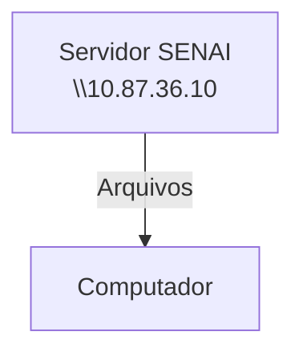
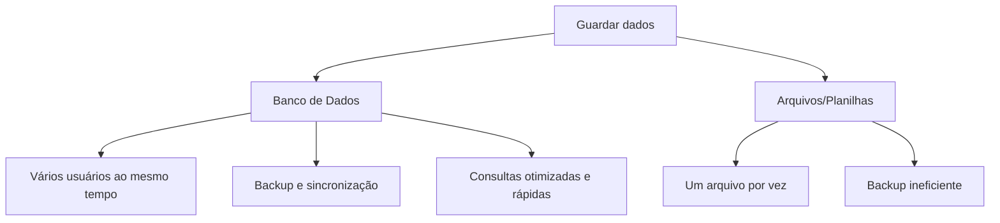

# Configuração do servidor educacional
## Simular um ambiente real de produção


---
**Objetivo**:
- Experiência real de mercado,
- Administração de recursos,
- Experiência em servidores Linux.
---

## Servidor de arquivos
Servidor educacional para arquivos, assim não dependendo da rede externa


---
## Servidor de desenvolvimento
Cada aluno recebe seu própio acesso, cada maquina possui um endereço de IP diferente

>192.168.10.16

|Recurso|Configuração|
|-------|------------|
|CPU|2 cores|
|RAM| 512 MB|
|DISCO| 6 GB|
|SISTEMA OPERACIONAL| U buntu 26.04 LTS|
|ACESSO| SSH (Secure Shell)|

## Dados de acesso:
|Campo|Valor|
|---|----|
|IP do Conttainer|192.168.10.16
|Usuário|Root|
|Senha Inicial|aluno01|


Comando para visualizar uso de recursos:
```bash
htop
```

Comando para alteração de senha: 
```bash
passwd
```
---

## Banco de dados
- Dados: Isoladas não dizem muita coisa. 
Ex: Elis, câmera, corretivo

- Informação: Dados estruturados. Ex: A Elis tirou uma foto com sua camêra do corretivo

- Conhecimento: O que podemos descobrir com as informações. Ex: Elis tem um corretivo


--- 

O fluxo normal de um banco de dados, está representado à seguir:


>Por qual razão, as empresas não salvam os dados em arquivos comuns?


---


## SGBD
Sistema Gerenciador de Bancos de Dados.
>POSTGRESQL: SGBD OpenSource e muito completo

Primeiro, começamos atualizando os pacotes:
```bash
sudo apt update && upgrade
```

Para instalação do Postgresql:
```bash
sudo apt install -y postgesql