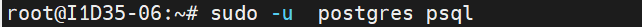
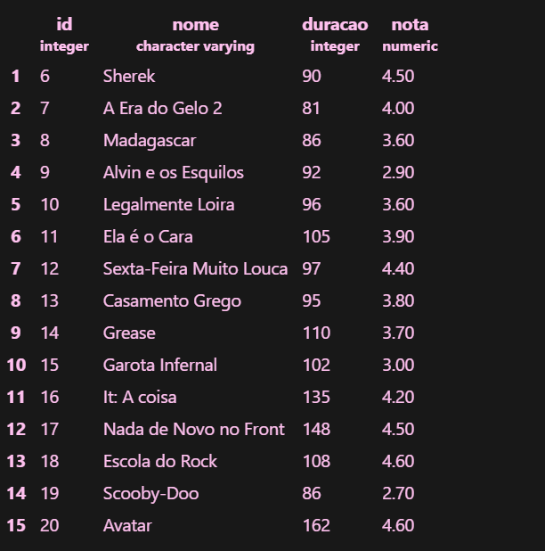

# Aula 04 
## Banco de dados site de avaliação de filmes

Para criar a Streaming abrimos nosso servidor no MOBA e utilizamos o comando:

```sql
sudo -u  postgres psql
```



---


Agora criamos a tabela "popcorn"

```sql
CREATE TABLE popcorn(
    id INT GENERATED ALWAYS AS IDENTITY PRIMARY KEY,
    nome VARCHAR(100) NOT NULL,
    duracao INT NOT NULL DEFAULT 0,
    nota NUMERIC(10,2) NOT NULL
);
```


Adicionamos os dados da tabela

```sql
INSERT INTO popcorn(nome,duracao,nota) VALUES
('O Diabo veste prada','109','4.2'),
('As Branquelas','109','4.2'),
('Todo Mundo em Pãnico','88','3.1'),
('Se Beber, Não Case!','100','4.4'),
('Projeto X','88','3.2'),
('Sherek','90','4.5'),
('A Era do Gelo 2','81','4.0'),
('Madagascar','86','3.6'),
('Alvin e os Esquilos','92','2.9'),
('Legalmente Loira','96','3.6'),
('Ela é o Cara','105','3.9'),
('Sexta-Feira Muito Louca','97','4.4'),
('Casamento Grego','95','3.8'),
('Grease','110','3.7'),
('Garota Infernal','102','3.0'),
('It: A coisa','135','4.2'),
('Nada de Novo no Front','148','4.5'),
('Escola do Rock','108','4.6'),
('Scooby-Doo','86','2.7'),
('Avatar','162','4.6');
```

---

Para mudar as notas dos filmes escolhidos usamos o comando

```sql
UPDATE popcorn --autalizar dados
SET nota = 5 WHERE id = 1;
UPDATE popcorn
SET nota = 4 WHERE id = 2;
UPDATE popcorn
SET nota = 4.6 WHERE id = 3;
UPDATE popcorn
SET nota = 4.5 WHERE id = 4;
UPDATE popcorn
SET nota = 3.5 WHERE id = 5;
SELECT * FROM popcorn 
```

---

Para deletar os filmes selecionados usamos o comando

```sql
DELETE FROM popcorn WHERE id=1;
DELETE FROM popcorn WHERE id=2;
DELETE FROM popcorn WHERE id=3;
DELETE FROM popcorn WHERE id=4;
DELETE FROM popcorn WHERE id=5;
```

>Usar esse comando com cuidado!


Resultado final da tabela:

